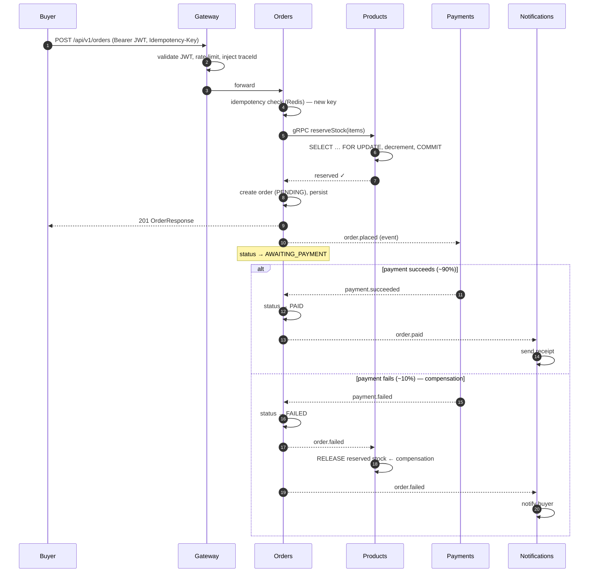

# Design Doc — Event-Driven E-Commerce Platform

**Status:** Draft — design ahead of implementation
**Author:** Ezekiel Akoji
**Last updated:** 2026-06-19

> This is the narrative design document — meant to be read start to finish. It tells
> the story: the problem, the shape of the solution, the journey of a request, and
> what was deliberately chosen *and not chosen*. It is intentionally light on
> mechanics; the detail lives in [`technical-design/`](technical-design/):
> [C4 model](technical-design/c4/) (structure), [ADRs](technical-design/adr/)
> (decisions, with alternatives), and [feature specs](technical-design/features/)
> (behaviour). Links point there at each junction.

---

## 1. Overview

This is a microservices e-commerce platform: customers browse a catalogue, place
orders, and pay; administrators manage products and fulfil operations. Six services
communicate over a mix of REST, gRPC, and an event bus, backed by PostgreSQL and
Redis, fully containerised and observable.

The defining characteristic is that **the purchase flow is event-driven and
resilient by design**. A payment can fail; stock can run out under a race; a client
can retry a submission it isn't sure went through. The system is built so that none
of these corrupt state — and so that the recovery path, not just the happy path, is
exercised on every run.

One paragraph version: *A buyer's order reserves stock atomically, then a
choreographed saga drives it to `PAID` or — on payment failure — to `FAILED` while
compensating by releasing the reserved stock and notifying the buyer. No
distributed transaction, no central coordinator; consistency is eventual and
achieved through events plus compensation.*

---

## 2. Context & problem

The brief is a take-home for a fintech end-client migrating toward Clojure and
event-driven architecture. The literal requirements — a product catalogue, ordering,
payment, an admin surface — could be satisfied by a monolith with one database and
no message queue, and in many real contexts that would be the *correct* answer.

This submission deliberately builds more than that, for two reasons stated honestly
up front:

1. **It is a portfolio of judgment, not just function.** The audience is evaluating
   how a candidate reasons about distributed systems — resilience, idempotency,
   consistency, observability — which a monolith would not exercise.
2. **The client's stated direction is Clojure/EDA.** Decisions are made to *rehearse*
   that destination: a framework-free functional domain, an event backbone, clean
   service boundaries.

The trade-off is not hidden. It is the [scope note](README.md), repeated in the
[technical-design README](technical-design/README.md): a simpler solution would meet
the requirements, and each added piece of architecture is documented with *when it
earns its place and when it would not*. This document is partly the record of that
discipline.

---

## 3. Goals & non-goals

### Goals

- **Correctness under concurrency and failure** — no oversold stock, no duplicate
  orders, no money/inventory state corrupted by a failed payment.
- **Resilience as a first-class property** — retries, idempotency, compensation,
  circuit breaking; the failure path is designed, not assumed away.
- **End-to-end observability** — every request and event traceable across services.
- **Evolvability toward Clojure/EDA** — a pure, portable domain; a swappable event
  bus and datastore.
- **Runs anywhere, for free** — one `make up`, no cloud account, no paid services.

### Non-goals (deliberately out of scope)

- A production deployment (Kubernetes, IaC, managed datastores) — documented as the
  path, not built. See the [production-path tier](technical-design/README.md#conventions).
- A real payment provider — Payments is a [fake processor](technical-design/features/purchase-saga.md#the-fake-payment-processor)
  so the saga's compensation path is testable on demand.
- An analytics/OLAP pipeline — the design only ensures the seed exists
  ([ADR-012](technical-design/adr/ADR-012-oltp-olap.md)).
- Horizontal scale-out concerns (multi-host discovery, partitioned event log) —
  each has a named upgrade path rather than an implementation.

---

## 4. The solution, in shape

Six services, each owning one bounded context and its own data:

| Service | Owns | Notable role |
|---|---|---|
| **Gateway** | nothing (edge only) | One front door: auth, routing, rate limiting, circuit breaking |
| **Users** | identity | JWT issuance, refresh-token rotation, RBAC |
| **Products** | catalogue + inventory | Search, CSV import, the gRPC stock server |
| **Orders** | order lifecycle | Idempotent placement, stock reservation, saga participant |
| **Payments** | payment records | Fake processor, saga participant |
| **Notifications** | delivery log | Pure event consumer — emails, calls no one |

Three communication styles, **each chosen for a reason** rather than uniformly:

- **REST** at the edge — universal, cacheable, the natural browser contract.
- **gRPC** for the single synchronous internal hop on the hot path (Orders →
  Products stock check) — binary, strongly typed, low latency
  ([ADR-009](technical-design/adr/ADR-009-grpc-internal.md)).
- **Redis Streams** for everything asynchronous — the event backbone that lets
  services react without calling each other
  ([ADR-002](technical-design/adr/ADR-002-event-bus.md)).

The guiding discipline: **synchronous only where a caller genuinely needs an answer
to proceed; everything else is an event.** Orders cannot reserve stock it hasn't
confirmed exists (sync). Orders does not need to wait for an email to be sent
(event).

The full picture, zooming in level by level, is the [C4 model](technical-design/c4/) —
[Context](technical-design/c4/L1-system-context.md) →
[Containers](technical-design/c4/L2-containers.md) →
[Components](technical-design/c4/L3-components.md) →
[Code](technical-design/c4/L4-code.md).

### Data ownership without five databases

One PostgreSQL instance holds **five schemas**, one per service, with **no
cross-schema access**. This buys private, independently-evolvable storage today
while keeping the path to true database-per-service a connection-string change, not
a rewrite ([ADR-001](technical-design/adr/ADR-001-database.md)). Redis does four
distinct jobs — event bus, read cache, rate-limit counters, idempotency store — and
is **never the source of truth**, and **never caches stock**.

### A domain that doesn't know it's in Spring

Every service is built [hexagonally](technical-design/adr/ADR-004-hexagonal-arch.md):
a pure `domain` of immutable records and rules, an `application` layer of use cases
and ports, and `infrastructure`/`api` adapters at the edges. The business logic
imports no framework. Combined with a
[functional Java style](technical-design/adr/ADR-005-functional-java.md) — records,
no setters, `Optional` over null — the domain is unit-testable in milliseconds and
portable to a future Clojure rewrite. This is the architecture rehearsing the
client's destination.

---

## 5. The journey of a request

The whole design is best understood by following one purchase end to end. This is
the path that touches every decision.

Reading the steps against the design:

1. **The edge does its job once** (steps 1–3). The Gateway validates the JWT,
   enforces the rate limit, and stamps a `traceId` so the rest of the journey is
   traceable. Downstream services trust the verified identity but re-check
   authorization ([Auth & RBAC](technical-design/features/auth-and-rbac.md),
   [ADR-006](technical-design/adr/ADR-006-api-gateway.md)).
2. **Retry safety comes before anything else** (step 4). The `Idempotency-Key` is
   checked first; a repeated submission returns the original order instead of
   creating a second ([Order Placement](technical-design/features/order-placement.md)).
3. **The one synchronous internal call is the one that must be** (steps 5–7).
   Reservation needs a yes/no answer, under a row lock, on real PostgreSQL — which
   is why integration tests use Testcontainers, not H2
   ([ADR-008](technical-design/adr/ADR-008-testcontainers.md)). This is also the
   only gRPC call ([ADR-009](technical-design/adr/ADR-009-grpc-internal.md)).
4. **The response doesn't wait for the saga** (steps 8–10). The buyer gets `201`
   the moment the order is durably `PENDING`; payment proceeds asynchronously.
5. **The saga choreographs the rest** (steps 11+). No coordinator drives it; each
   service reacts to events. The failure branch *compensates* — releasing the stock
   reserved in step 6 — which is the substitute for a cross-service rollback that
   cannot exist ([Purchase Saga](technical-design/features/purchase-saga.md),
   [ADR-003](technical-design/adr/ADR-003-choreography.md)).

Every event carries full state and a unique `eventId`; every consumer is idempotent
on it, so Redis Streams' at-least-once redelivery is safe by design.

---

## 6. Cross-cutting concerns

| Concern | Approach | Detail |
|---|---|---|
| **Idempotency** | Order placement dedupes on `Idempotency-Key`; every event consumer dedupes on `eventId`. | [Order Placement](technical-design/features/order-placement.md), [Purchase Saga](technical-design/features/purchase-saga.md) |
| **Consistency** | No distributed transaction. Local transaction + event + idempotent consumer; failure → compensation. Eventual consistency, explicitly. | [ADR-003](technical-design/adr/ADR-003-choreography.md) |
| **Authorization** | Verified once at the Gateway, re-checked (incl. ownership) in each service — defence in depth. | [Auth & RBAC](technical-design/features/auth-and-rbac.md) |
| **Input trust** | All external input — bodies, CSV rows, event payloads — validated and sanitised at the boundary. CSV import is the stress case. | [CSV Import](technical-design/features/csv-import.md) |
| **Observability** | Micrometer/Prometheus + Loki + Jaeger, correlated by `traceId`; structured JSON logs; no PII in logs; no high-cardinality IDs as metric tags. | [ADR-007](technical-design/adr/ADR-007-observability.md) |
| **Read performance** | CQRS at the application layer — Redis read cache (TTL 60s) for the catalogue; stock never cached. | [ADR-011](technical-design/adr/ADR-011-cqrs.md), [Catalogue & Search](technical-design/features/catalogue-and-search.md) |
| **Resilience** | Per-downstream circuit breakers and rate limits at the edge; DLQ example on `payment.failed`; bus retains events for downed consumers. | [ADR-006](technical-design/adr/ADR-006-api-gateway.md), [Purchase Saga](technical-design/features/purchase-saga.md) |

---

## 7. Alternatives considered (at the system level)

Individual decisions are recorded as [ADRs](technical-design/adr/) with their own
alternatives. At the *whole-system* level, the headline fork was:

**A monolith with one database and no queue.** This would satisfy the literal
requirements, deploy more simply, and be easier to operate. It was rejected *not
because it is wrong* — it is the right answer in many contexts — but because it
would not exercise the distributed-systems judgment this submission exists to
demonstrate, nor rehearse the client's stated Clojure/EDA direction. The honest
counterfactual is documented rather than dismissed; see the
[scope note](README.md).

The other system-shaping forks, each with its own record:

- **Orchestration vs choreography** for the saga — chose choreography, with Temporal
  as the production path ([ADR-003](technical-design/adr/ADR-003-choreography.md)).
- **Kafka vs Redis Streams** for the bus — chose Streams (already in stack), Kafka
  documented ([ADR-002](technical-design/adr/ADR-002-event-bus.md)).
- **Datadog vs the Grafana stack** — chose open-source, vendor-neutral via
  Micrometer/OTEL ([ADR-007](technical-design/adr/ADR-007-observability.md)).

---

## 8. Operational considerations

- **Local entry point** is a `Makefile` — `make up`, `make seed`, `make smoke`,
  `make test`. Observability runs as an opt-in overlay so the core system can start
  without four extra containers ([ADR-007](technical-design/adr/ADR-007-observability.md)).
- **Health & metrics** — every service exposes `/actuator/health` and
  `/actuator/prometheus`.
- **Service discovery** — none; Docker DNS suffices on a single host
  ([ADR-010](technical-design/adr/ADR-010-service-registry.md)).
- **Failure blast radius** — a shared Postgres and a multi-purpose Redis are
  single-host blast radii, accepted at this scale and addressed by the documented
  per-service-DB and dedicated-infrastructure paths.
- **Testing** spans the full pyramid — fast pure-domain unit tests, Testcontainers
  integration tests for the concurrency- and bus-sensitive paths, one illustrative
  contract test, Playwright E2E, k6 performance, and a smoke script
  ([test strategy](technical-design/features/README.md#test-strategy-summary)).

---

## 9. Future considerations (production path)

The architecture is shaped so each of these is an upgrade, not a rewrite:

- **Database-per-service** — connection-string change; the no-cross-schema discipline
  already guarantees it ([ADR-001](technical-design/adr/ADR-001-database.md)).
- **Kafka** behind the existing `EventPublisher`/`EventListener` ports
  ([ADR-002](technical-design/adr/ADR-002-event-bus.md)).
- **Temporal** for saga orchestration as flows gain branches and timers
  ([ADR-003](technical-design/adr/ADR-003-choreography.md)).
- **Kubernetes + IaC + service discovery** for multi-host scale
  ([ADR-010](technical-design/adr/ADR-010-service-registry.md)).
- **OLAP pipeline** (Debezium → Kafka → warehouse), seeded by today's rich event log
  ([ADR-012](technical-design/adr/ADR-012-oltp-olap.md)).
- **Clojure migration** — the framework-free functional domain is the groundwork
  ([ADR-005](technical-design/adr/ADR-005-functional-java.md)).

---

## 10. Where to go next

- **Structure** → [C4 model](technical-design/c4/)
- **Decisions & rejected alternatives** → [ADRs](technical-design/adr/)
- **Behaviour, edge cases, failure handling** → [Feature specs](technical-design/features/)
- **How to run it** → [README](README.md)

> **A note on status.** This document and the design set describe the *target*
> architecture; implementation is in progress. As features are built, deltas will be
> reconciled back into the affected ADRs and feature specs rather than silently
> edited — a changed decision earns a superseding record. Treat the present tense
> here as design intent until the corresponding code lands.
