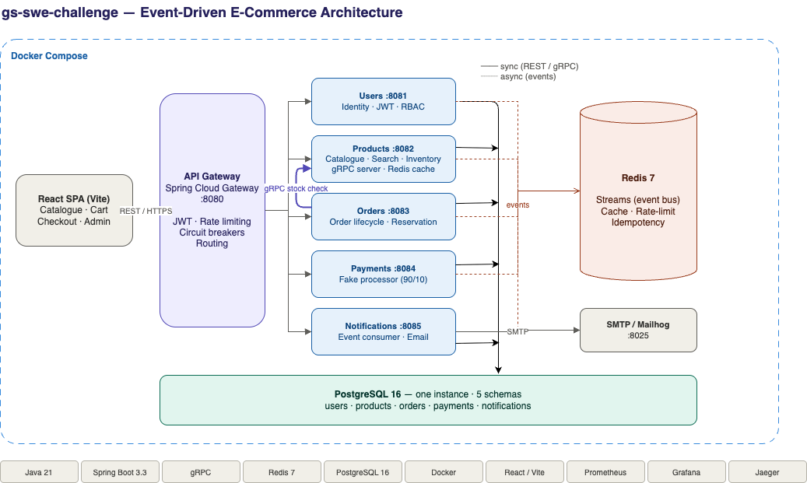

# gs-swe-challenge

**An event-driven e-commerce platform** — a customer storefront and admin back
office built on a microservices architecture designed for reliability, scale,
and clean service ownership. Java 21 · Spring Boot · hexagonal architecture ·
Redis Streams (EDA) · Saga choreography · PostgreSQL · gRPC · React.

---

## Engineering philosophy

This platform is deliberately built beyond the minimum needed to stand up a
basic online store. That is intentional.

The architecture reflects the kind of systems I design and operate
professionally. It is not an attempt to over-engineer a simple problem without
awareness of the trade-offs involved.

A simpler solution (a monolith, a single database, no message queue) would serve
a small store perfectly well and would be the correct choice in many real-world
contexts. That trade-off is documented explicitly in the design doc, including
when each architectural decision adds value and when it would not.

---

## Overview

A storefront and admin platform for a catalog-driven e-commerce business,
decomposed into six independently deployable services that communicate over a
mix of synchronous (REST, gRPC) and asynchronous (Redis Streams) channels. The
purchase flow is implemented as a **choreographed Saga** with compensating
actions, so a failed payment cleanly releases reserved stock and notifies the
buyer without a central orchestrator.

The design emphasizes the qualities a production commerce platform cares about:
clear service boundaries, idempotency, fault tolerance (retries, circuit
breakers, rate limiting), schema isolation, and end-to-end observability.

## Architecture



### Services

| Service       | Port | Responsibility |
|---------------|------|----------------|
| Gateway       | 8080 | Routing, JWT validation, rate limiting (Bucket4j), circuit breakers (Resilience4j), request-ID injection. No business logic. |
| Users         | 8081 | Registration, login, JWT issuance + refresh, roles (BUYER/ADMIN), profiles. |
| Products      | 8082 | Catalog, inventory, full-text search, categories, async CSV import, gRPC server. |
| Orders        | 8083 | Order lifecycle, stock reservation, idempotency, Saga participant. gRPC client → Products. |
| Payments      | 8084 | Fake payment processor (90% success / 10% failure), payment records, Saga participant. |
| Notifications | 8085 | Pure event consumer. Email templates via Mailhog. Delivery log. |

### Communication

- **External:** REST (Gateway → React frontend)
- **Internal sync:** gRPC (Orders → Products stock check)
- **Async:** Redis Streams (event-driven choreography between services)

### Data

- **PostgreSQL 16** — one instance, five isolated schemas
  (`users_schema`, `products_schema`, `orders_schema`, `payments_schema`,
  `notifications_schema`), Flyway migrations per service.
- **Redis 7** — cache (product list/search, TTL 60s), event streams,
  rate-limit buckets, and order idempotency keys.

### Purchase Saga

```
HAPPY PATH                          COMPENSATION PATH
order.placed                        order.placed
  → Payments: process                 → Payments: process
  → payment.succeeded                 → payment.failed
    → Orders: status → PAID             → Orders: status → FAILED
    → Notifications: receipt            → Products: release reserved stock
                                        → Notifications: failure notice
```

## Tech stack

- **Backend:** Java 21, Spring Boot 3.3.x, Gradle 8.x (multi-module), hexagonal
  architecture, functional Java style (immutable records, no setters in domain).
- **Frontend:** React + Vite (JavaScript), Zustand, Tailwind CSS.
- **Messaging:** Redis Streams. **RPC:** gRPC. **Auth:** JWT (HS256, jjwt).
- **Observability:** Micrometer → Prometheus, Logback JSON → Loki,
  OpenTelemetry → Jaeger, dashboards in Grafana. Correlated via `traceId` in MDC.
- **Infra:** Docker + Docker Compose, GitHub Actions CI, Makefile entry point,
  Mailhog for local mail.

## Getting started

### Prerequisites

- Docker Desktop (running)
- VS Code with the **Dev Containers** extension

### Open the dev container

```bash
# In VS Code: open the gs-swe-challenge/ folder, then
#   Command Palette → "Dev Containers: Reopen in Container"
```

The container (Ubuntu 24.04 base) provisions the full toolchain on first build:
`make` + build tools, SDKMAN → **Java 21 + Gradle**, nvm → **Node LTS**,
**GitHub CLI**, and Docker (docker-in-docker). All builds, tests, and git/`gh`
commands run inside the container; your source is bind-mounted from the host.

### Run the stack

```bash
make up        # build + start all services (Docker Compose)
make up-obs    # also start the observability stack (Prometheus/Loki/Jaeger/Grafana)
make seed      # seed sample data + test users
make smoke     # run the smoke test against a running stack
make test      # run the JVM test suite
make down      # stop everything
make logs      # tail service logs
```

### Service URLs (local)

| Service       | URL                      |
|---------------|--------------------------|
| Gateway       | http://localhost:8080    |
| Users         | http://localhost:8081    |
| Products      | http://localhost:8082    |
| Orders        | http://localhost:8083    |
| Payments      | http://localhost:8084    |
| Notifications | http://localhost:8085    |
| Frontend      | http://localhost:3000    |
| Grafana       | http://localhost:3001    |
| Jaeger        | http://localhost:16686   |
| Mailhog       | http://localhost:8025    |
| Prometheus    | http://localhost:9090    |

### Seed credentials

```
admin@gsswec.com / admin123   [ADMIN]
buyer@gsswec.com / buyer123   [BUYER]
```

## Project structure

```
gs-swe-challenge/
├── README.md
├── Makefile                 # entry point (up, test, smoke, seed)
├── .devcontainer/           # VS Code dev container (toolchain provisioning)
├── docs/                    # design doc, ADRs, API specs, runbooks
├── shared/                  # event definitions + shared DTOs (pure Java records)
├── services/                # gateway, users, products, orders, payments, notifications
├── frontend/                # React + Vite + Tailwind + Zustand
├── tests/                   # e2e (Playwright), performance (k6), smoke
├── infra/                   # docker-compose + observability configs
└── scripts/                 # seed-data and helpers
```

Each service follows the same hexagonal layout: `domain/` (pure records, zero
Spring), `application/` (use cases), `infrastructure/` (Spring, JPA, Redis,
HTTP/gRPC), and `api/` (controllers + DTOs).

## Testing

A full test pyramid: JUnit 5 + Mockito + AssertJ unit tests; Spring Boot Test +
Testcontainers integration tests against real PostgreSQL and Redis (including
concurrent stock-reservation locking); one illustrative Spring Cloud Contract;
Playwright E2E for critical paths; and k6 performance scenarios.

## Implementation levels

Consistent with the scope note, components are delivered at three levels:

- **Fully implemented:** the six services, EDA + Saga, JWT auth + RBAC, Redis
  (cache, streams, rate limiting, idempotency), gRPC, Docker Compose, the
  observability stack, unit + integration tests, and CI.
- **Illustrative (one example + documented):** Spring Cloud Contract, dead-letter
  queue handling, and the CQRS read/write model split.
- **Documented only (production path):** Kafka, Kubernetes + Helm, Terraform/IaC,
  Consul, Datadog, separate DB per service, GraphQL, Temporal, Vault, and the
  OLAP pipeline (Debezium → Redshift). Each is discussed in the design doc as the
  scale-up path with its trade-offs.

## Architecture decisions

Key decisions are recorded as ADRs under [`docs/adr/`](docs/adr/) — including
PostgreSQL over MongoDB, Redis Streams over Kafka, Saga choreography over
orchestration, hexagonal architecture, functional Java, and the observability
stack choice. The full rationale lives in the design doc at
[`docs/design/DESIGN_DOC.md`](docs/design/DESIGN_DOC.md).

## AI-assisted development

This project was built with AI-assisted tooling. Architecture, design
trade-offs, and final implementation decisions are my own; AI was used to
accelerate scaffolding, boilerplate, and documentation.
