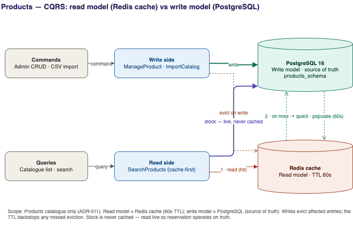

# ADR-011 — CQRS at the application layer (Redis read model)

**Status:** Accepted

## Context

The product catalogue is **read-heavy and write-light**: many shoppers browse and
search; admins update products comparatively rarely. Serving every catalogue read
straight from PostgreSQL — including full-text search — is wasteful for hot,
repeated queries, and couples read latency to write-model contention.

We want to optimise reads without compromising the integrity of the write model,
and to demonstrate the **CQRS** pattern without over-engineering it into full event
sourcing.

## Decision

Apply **CQRS at the application layer** in the Products service:

- **Write model** — PostgreSQL is the source of truth for products. All mutations
  (create/update/delete, CSV import) go here.
- **Read model** — **Redis cache** of product list/search results, **TTL 60s**.
  Catalogue reads hit the cache first; on miss, query Postgres and populate.
- The split is made explicit in code as `ProductReadModel` vs `ProductWriteModel`
  (illustrative tier — one worked example of the separation, not a fully separate
  read store).
- **Invalidation** — writes evict affected cache entries; the 60s TTL bounds
  staleness as a backstop.

**Hard rule: stock levels are never cached.** Stock must be read live from the
write model so reservation ([Order Placement](../features/order-placement.md))
operates on truth, never a stale count. The read cache is for catalogue
*presentation* data only.

## Alternatives Considered

| Option | Why not |
|---|---|
| **No CQRS — every read straight from Postgres** | Simplest, and correct for low traffic. We add the read cache because the catalogue is the hottest read path and the pattern is core to the JD's interests; the trade-off is documented as "skip this under low load." |
| **Full CQRS with a separate read database** | A materialised read store (e.g. a denormalised view kept in sync by events) is the heavyweight version — justified at scale, overkill here. The Redis cache captures the read/write-separation idea at a fraction of the cost. |
| **Event sourcing** | Powerful but a large conceptual and operational commitment; unnecessary when the write model as current-state in Postgres serves us well. Out of scope. |

## Consequences

**Positive**
- Hot catalogue/search reads are served from Redis — lower latency, less write-model
  load.
- Read and write paths are separable and independently optimisable.
- Demonstrates CQRS pragmatically, with an explicit read-vs-write-model example.

**Negative / accepted**
- Reads can be **stale by up to 60s** — fine for catalogue presentation, which is
  why stock (where staleness is dangerous) is explicitly excluded.
- Cache invalidation adds complexity and a correctness surface. Bounded by the TTL
  so a missed eviction self-heals within 60s.
- Eventual consistency between read and write models must be understood by anyone
  reasoning about reads.

**Production path:** a materialised read store kept in sync via the event bus if
read scale demands it; otherwise this layer-level CQRS is the right size.

## Related

- [ADR-001](ADR-001-database.md) (write model) · [ADR-002](ADR-002-event-bus.md) ·
  [Catalogue & Search](../features/catalogue-and-search.md)
