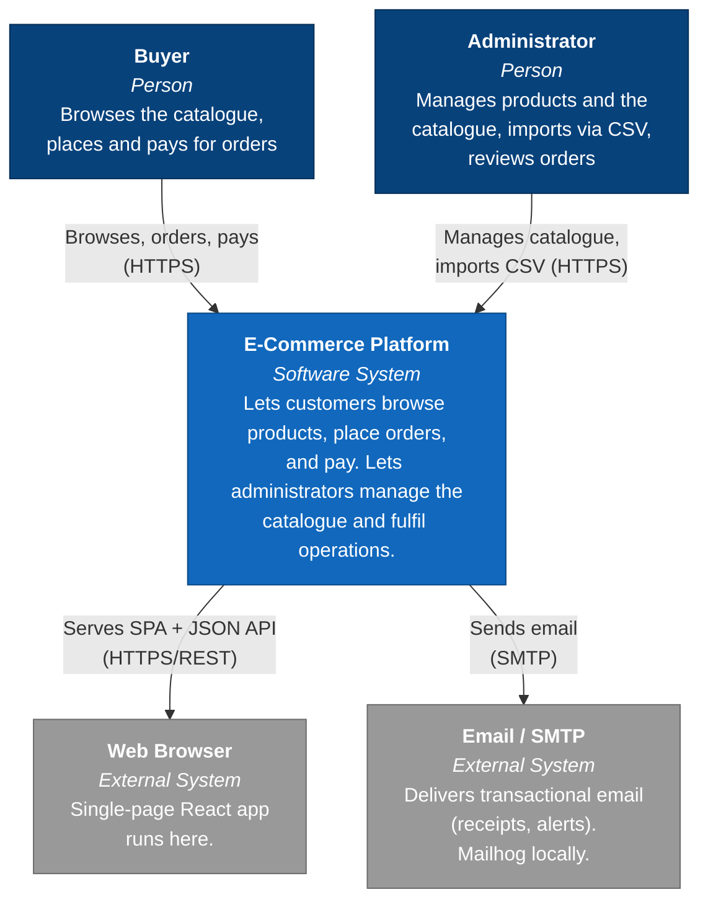

# C4 Level 1 — System Context

The widest view: the platform as a single black box, who uses it, and the external
systems it depends on. No internal structure — that is [Level 2](L2-containers.md).

## Diagram

## Actors

| Actor | Type | Goals |
|---|---|---|
| **Buyer** | Person (role `BUYER`) | Discover products via search and filters; place an order; pay; track order status; receive a receipt. |
| **Administrator** | Person (role `ADMIN`) | Create/update/delete products; bulk-import the catalogue from CSV; view all orders; adjust order status; review notification delivery. |

Both authenticate against the platform; their capabilities differ by role
(see [Authentication & RBAC](../features/auth-and-rbac.md)).

## External dependencies

| System | Relationship | Notes |
|---|---|---|
| **Web browser** | Hosts the React SPA the platform serves. | The only client; there is no native or third-party API consumer in scope. |
| **Email / SMTP** | The platform pushes transactional email outward. | Locally this is **Mailhog** (captures mail, no real delivery). In production this is a real SMTP relay or provider — a configuration change, not a code change, per [ADR-007](../adr/ADR-007-observability.md). |

## What is deliberately *not* here

This is a self-contained system. There is no external payment provider — the
Payments service is an in-process **fake processor** (90% success / 10% random
failure) so the full saga, including the compensation path, can be exercised
deterministically in tests without a third-party sandbox. The rationale and the
production-path swap to a real PSP are covered in the
[Purchase Saga](../features/purchase-saga.md) spec and
[ADR-003](../adr/ADR-003-choreography.md).

## Quality attributes that shape everything below

The context is simple; the *non-functional* requirements are what justify the
architecture at lower levels. Stated here so they are not re-litigated in every
ADR:

- **Resilience** — a payment failure must not corrupt order or inventory state.
  Drives the saga + compensation design.
- **Idempotency** — a retried order submission must not create a duplicate order;
  a redelivered event must not double-apply. Drives idempotency keys and
  idempotent consumers.
- **Observability** — every request and event is traceable end-to-end across
  services. Drives the correlated traceId/metrics/logs stack.
- **Evolvability** — the stated end goal is a migration toward Clojure/EDA. Drives
  the hexagonal + functional-Java choices that keep the domain framework-free.
