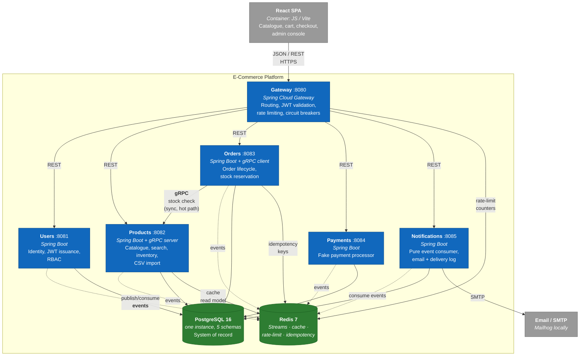

# C4 Level 2 — Containers

Stepping inside the [platform box](L1-system-context.md). A "container" in C4 is a
separately runnable/deployable thing — a service process, a database, a cache — not
a Docker container specifically (though here they mostly map one-to-one).

## Diagram

> **Edge legend.** Solid arrows are **synchronous** (REST/gRPC, request blocks on
> response). Dashed arrows are **asynchronous** events over Redis Streams (fire and
> forget; consumers react independently). This distinction is the single most
> important thing to read off this diagram.

## The six services

| Service | Port | Bounded context | Talks to | Key feature spec |
|---|---|---|---|---|
| **Gateway** | 8080 | Edge concerns only — *no business logic*. Validates JWTs once, routes to services, enforces rate limits, trips circuit breakers per downstream, injects a request/trace ID. | All services (REST); Redis (rate-limit counters). | [ADR-006](../adr/ADR-006-api-gateway.md) |
| **Users** | 8081 | Identity: registration, login, JWT issuance, refresh-token rotation, roles (`BUYER`/`ADMIN`), profiles. | PostgreSQL (`users_schema`); Redis (events). | [Auth & RBAC](../features/auth-and-rbac.md) |
| **Products** | 8082 | Catalogue, categories, full-text search, inventory, async CSV import. **Hosts the gRPC stock-check server.** | PostgreSQL (`products_schema`); Redis (cache + events). | [Catalogue & Search](../features/catalogue-and-search.md), [CSV Import](../features/csv-import.md) |
| **Orders** | 8083 | Order lifecycle, stock reservation (`SELECT … FOR UPDATE`), idempotent placement, saga participant. **gRPC client to Products.** | PostgreSQL (`orders_schema`); Products (gRPC); Redis (idempotency + events). | [Order Placement](../features/order-placement.md), [Purchase Saga](../features/purchase-saga.md) |
| **Payments** | 8084 | Fake payment processing (90% success / 10% failure), payment records, saga participant. | PostgreSQL (`payments_schema`); Redis (events). | [Purchase Saga](../features/purchase-saga.md) |
| **Notifications** | 8085 | **Pure event consumer.** Renders email templates, sends via SMTP, records a delivery log. Exposes only one admin read endpoint. | PostgreSQL (`notifications_schema`); Redis (consume); SMTP. | [Notifications](../features/notifications.md) |

## The two datastores

### PostgreSQL 16 — system of record
One instance, **five schemas** (`users_schema`, `products_schema`,
`orders_schema`, `payments_schema`, `notifications_schema`). Each service owns its
schema exclusively — **no cross-schema queries, no foreign keys across schema
boundaries.** This buys service-data-ownership (a service's storage is private and
independently evolvable) while paying single-instance operational cost. The path
to a true database-per-service is then a connection-string change, documented in
[ADR-001](../adr/ADR-001-database.md). Each service owns its schema migrations via
**Flyway**.

### Redis 7 — four distinct roles
Redis is load-bearing but is **never the source of truth**:

1. **Event bus** — Redis Streams carry all 15 async events between services
   ([ADR-002](../adr/ADR-002-event-bus.md)).
2. **Read cache** — Products caches list/search results, TTL 60s. **Stock levels
   are never cached** — they must be read live to keep reservation correct.
3. **Rate-limit counters** — Bucket4j stores its buckets in Redis so limits hold
   across Gateway replicas ([ADR-006](../adr/ADR-006-api-gateway.md)).
4. **Idempotency store** — Orders persists idempotency keys (TTL 24h) so a retried
   submission returns the original result instead of creating a duplicate.

## Communication styles — and why each

| Style | Where | Why here |
|---|---|---|
| **REST/JSON** | Browser → Gateway → services. | Universal, cacheable, the natural fit for a browser client and external surface. |
| **gRPC** | Orders → Products (stock check). | The one synchronous internal call on the order hot path. Binary, strongly-typed contract, low latency. [ADR-009](../adr/ADR-009-grpc-internal.md). |
| **Redis Streams (events)** | Everything async — the saga, notifications, stock-depletion alerts, etc. | Decouples producers from consumers, absorbs load, and enables choreography without services synchronously calling each other. [ADR-002](../adr/ADR-002-event-bus.md). |

The discipline: **synchronous only where a caller genuinely needs an answer to
proceed** (Orders cannot reserve stock it hasn't confirmed exists). Everything that
can be a reaction is an event.

## Cross-cutting at this level

- **Service discovery**: none. Docker DNS resolves service names on a single host.
  Consul/K8s DNS is the documented scale-up ([ADR-010](../adr/ADR-010-service-registry.md)).
- **Observability**: every container exposes `/actuator/health` and
  `/actuator/prometheus`; emits structured JSON logs and OpenTelemetry traces, all
  correlated by `traceId` ([ADR-007](../adr/ADR-007-observability.md)).
