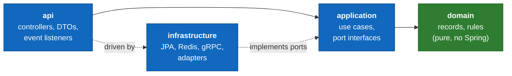

# C4 Level 3 — Components

Stepping inside the [service containers](L2-containers.md). Every service shares
the same internal *shape* — the four hexagonal layers documented at
[Level 4](L4-code.md). This page names the significant **components** within that
shape, service by service, and the responsibility of each.

A "component" here is a grouping of related code behind a clear responsibility (a
controller, a use-case service, an adapter), not necessarily a single class.

## The shared shape

Read [Level 4](L4-code.md) first if the layering is unfamiliar. In brief, every
service has:

The tables below list, per service, the notable components in each layer. Generic
plumbing (config classes, mappers) is omitted.

## Gateway (:8080)

The exception to the shape — it has **no domain or application layer**, because it
holds no business logic. It is a thin edge of filters.

| Component | Layer | Responsibility |
|---|---|---|
| **Route configuration** | infra | Maps `/api/**` paths to downstream services; declares which routes are public (no JWT). |
| **JWT validation filter** | infra | Verifies the access-token signature/expiry once, at the edge; rejects invalid tokens; forwards identity claims downstream. |
| **Rate-limit filter** | infra | Bucket4j buckets (in Redis) keyed per route — by IP for public/auth routes, by userId for authenticated routes. |
| **Circuit-breaker filter** | infra | Resilience4j breaker per downstream; sheds load and returns a fast error when a service is unhealthy. |
| **Request-ID filter** | infra | Generates/propagates the `traceId` into MDC and downstream headers so a request is traceable end-to-end. |

See [ADR-006](../adr/ADR-006-api-gateway.md).

## Users (:8081)

| Component | Layer | Responsibility |
|---|---|---|
| **AuthController / UserController** | api | `/auth/*` (register, login, refresh, logout) and `/users/*` endpoints. |
| **RegisterUser / AuthenticateUser / RotateRefreshToken** | application | Use cases — orchestrate domain + ports, publish `user.registered` / `user.role_changed`. |
| **User, Role, RefreshToken** | domain | Immutable records and the rules (password-hash never exposed, role transitions). |
| **JwtIssuer** | infra | Signs HS256 access tokens (15 min) and mints opaque refresh tokens. |
| **UserJpaAdapter / RefreshTokenJpaAdapter** | infra | Persist to `users_schema`; refresh tokens stored **hashed** (SHA-256). |
| **EventPublisher** | infra | Publishes user events to Redis Streams. |

See [Auth & RBAC](../features/auth-and-rbac.md).

## Products (:8082)

| Component | Layer | Responsibility |
|---|---|---|
| **ProductController / CategoryController** | api | Public catalogue reads; admin CRUD; multipart import endpoint. |
| **ImportEventListener** | api | Consumes `order.failed` / `order.cancelled` to release reserved stock. |
| **StockGrpcService** | api (gRPC) | The gRPC server endpoint Orders calls to check/decrement stock. |
| **SearchProducts / ManageProduct / ImportCatalog** | application | Catalogue read use cases (CQRS read side), admin write use cases, the async CSV import orchestration. |
| **CsvValidator** | application | Row-level validation/sanitisation — the heart of [CSV Import](../features/csv-import.md). |
| **Product, Category, ImportJob, StockLevel** | domain | Records + invariants (`stock >= 0`, `price >= 0`, SKU uniqueness). |
| **ProductJpaAdapter** | infra | `products_schema` persistence; full-text search via the PG GIN index. |
| **ProductCacheAdapter** | infra | Redis read cache (TTL 60s) for list/search — **never stock**. |
| **CsvParserAdapter / EventPublisher** | infra | Streaming CSV parse; publishes `product.*` events. |

See [Catalogue & Search](../features/catalogue-and-search.md), [CSV Import](../features/csv-import.md).

## Orders (:8083)

| Component | Layer | Responsibility |
|---|---|---|
| **OrderController** | api | Place/list/get/cancel orders; admin status changes. Reads `Idempotency-Key` header. |
| **PaymentEventListener** | api | Consumes `payment.succeeded` → `PAID`, `payment.failed` → `FAILED` (saga). |
| **ProductEventListener** | api | Consumes `product.updated` / `product.deleted` / `product.stock_depleted`. |
| **PlaceOrder / CancelOrder / AdvanceOrderStatus** | application | Order use cases; enforce the status state machine; emit `order.placed` / `order.cancelled`. |
| **Order, OrderItem, OrderStatus** | domain | Records + the legal status-transition rules (the state machine lives here, in pure code). |
| **StockReservationService** | application | Reserves stock atomically before confirming an order. |
| **ProductGrpcClient** | infra | gRPC client to Products' stock server. |
| **OrderJpaAdapter** | infra | `orders_schema`; reservation via `SELECT … FOR UPDATE`. |
| **IdempotencyStore** | infra | Redis-backed; returns the prior result for a repeated key (TTL 24h). |

See [Order Placement](../features/order-placement.md), [Purchase Saga](../features/purchase-saga.md).

## Payments (:8084)

| Component | Layer | Responsibility |
|---|---|---|
| **PaymentController** | api | Read endpoints (`/payments/{id}`, `/payments/order/{id}`, admin list). |
| **OrderEventListener** | api | Consumes `order.placed` → triggers processing (saga entry). |
| **ProcessPayment** | application | Runs the fake processor; emits `payment.succeeded` / `payment.failed`; **idempotent** on `orderId`. |
| **Payment, PaymentStatus** | domain | Records + status rules. |
| **FakePaymentProcessor** | infra | 90% success / 10% deterministic-in-test failure. |
| **PaymentJpaAdapter / EventPublisher** | infra | `payments_schema`; publishes payment events. The DLQ example lives on `payment.failed`. |

See [Purchase Saga](../features/purchase-saga.md).

## Notifications (:8085)

| Component | Layer | Responsibility |
|---|---|---|
| **NotificationLogController** | api | The *only* public endpoint: `GET /notifications/logs` (ADMIN). |
| **EventListeners** | api | Consume the seven notification-triggering events (user/product/order/payment). |
| **SendNotification** | application | Selects template, renders, sends, records the log; **idempotent** on `eventId`. |
| **NotificationLog, EmailTemplate** | domain | Records. |
| **JavaMailAdapter** | infra | SMTP send via `JavaMailSender` (Mailhog locally). |
| **NotificationJpaAdapter** | infra | `notifications_schema` delivery log. |

See [Notifications](../features/notifications.md).

## What links the components together

The components are wired by two cross-service mechanisms, both detailed in their
own specs:

- **The event backbone** ([ADR-002](../adr/ADR-002-event-bus.md)): every
  `EventPublisher` writes to a Redis Stream; every `EventListener` reads from one.
  This is what makes the dashed arrows at [Level 2](L2-containers.md) work.
- **The shared event library**: the `BaseEvent` envelope and all 15 payload
  records live in a shared module (`com.gsswec.ecommerce.shared`) consumed by every
  service, so producers and consumers compile against the same contract.
