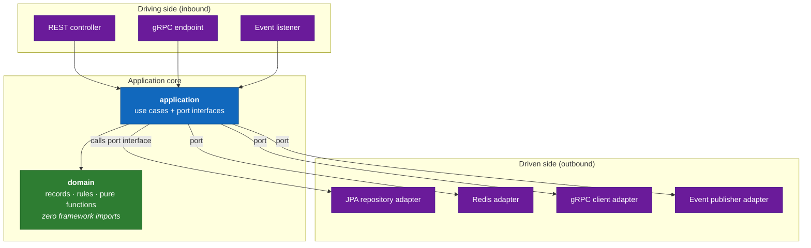
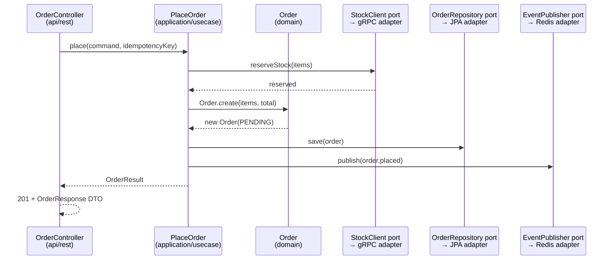

# C4 Level 4 — Code

The deepest zoom: how code is organised *inside* a service. C4 says document Level
4 only where it earns its keep. Here it earns it **once**, because all six services
share one layout — the hexagonal (ports & adapters) architecture mandated by
[ADR-004](../adr/ADR-004-hexagonal-arch.md) — and documenting the shared pattern is
far more useful than repeating six near-identical package trees.

## The hexagon

The principle: **the domain depends on nothing; everything depends inward.** The
business logic does not know it runs inside Spring, talks to PostgreSQL, or
publishes to Redis. Those are details plugged in at the edges through interfaces
("ports") implemented by "adapters."



The dependency rule reads off the arrows: **inbound adapters call use cases; use
cases call domain and call *out* through port interfaces; outbound adapters
implement those interfaces.** Nothing in `domain` or `application` imports Spring,
JPA, or Redis types.

## Package layout (every service)

```
com.gsswec.ecommerce.<service>
├── domain/                 ← pure Java. records, value objects, domain rules,
│                             domain exceptions. NO framework imports.
│   ├── model/              ← e.g. Order, OrderItem, OrderStatus (records)
│   └── service/            ← pure domain logic (e.g. status-transition rules)
│
├── application/            ← use cases + the ports they depend on
│   ├── usecase/            ← e.g. PlaceOrder, CancelOrder (one class per use case)
│   └── port/
│       ├── in/             ← inbound port interfaces (what the core offers)
│       └── out/            ← outbound port interfaces (what the core needs:
│                             OrderRepository, EventPublisher, StockClient…)
│
├── infrastructure/         ← Spring + technology adapters implementing out-ports
│   ├── persistence/        ← JPA entities + repository adapters (→ PostgreSQL)
│   ├── messaging/          ← Redis Streams publisher/consumer adapters
│   ├── grpc/               ← gRPC client/server adapters
│   └── config/             ← Spring @Configuration, bean wiring
│
└── api/                    ← inbound adapters: the system's public surface
    ├── rest/               ← controllers + request/response DTOs
    ├── grpc/               ← gRPC service implementations (Products only)
    └── event/              ← @EventListener consumers (saga participants)
```

> The domain entity and the JPA entity are **separate types**. The persistence
> adapter maps between them. This is deliberate: it keeps ORM annotations and
> lazy-loading semantics out of the domain, and it is what makes the domain
> portable to a future Clojure rewrite ([ADR-005](../adr/ADR-005-functional-java.md)).

## Functional-Java conventions

These rules ([ADR-005](../adr/ADR-005-functional-java.md)) apply throughout
`domain` and `application`:

| Rule | Why |
|---|---|
| **All domain objects are `record`s.** | Immutability by default; value semantics; no accidental mutation. |
| **No setters anywhere in domain/application.** | State changes produce *new* values (`order.withStatus(PAID)`), never mutate in place. |
| **`Optional` over `null`** at boundaries. | Absence is explicit and type-checked, not a NPE waiting to happen. |
| **Stream API over imperative loops** for transformations. | Declarative, composable, closer to the target Clojure idiom. |
| **Unmodifiable collections** returned from the domain. | A caller cannot mutate a list it was handed. |
| **Constructor injection only** (no field `@Autowired`). | Dependencies are explicit and the class is testable without a container. |

## How a request flows through the layers

Tracing `POST /api/v1/orders` end-to-end shows every layer doing its one job:



The controller never sees a JPA entity, the use case never imports a Redis class,
and the domain never knows any of them exist. That separation is the whole point —
and it is why the domain can be unit-tested with plain JUnit, no Spring context,
in milliseconds ([ADR-008](../adr/ADR-008-testcontainers.md) covers where the
*real*-dependency tests sit instead).

## Where this layout is bent

- **Gateway** has only `infrastructure` (filters/config) and `api` (routes) — no
  domain or application, because it carries no business logic. See its
  [L3 entry](L3-components.md#gateway-8080).
- **Notifications** has a thin domain (a log record, a template enum) — most of its
  weight is inbound event adapters. The shape still holds; it is just light on the
  domain side.
