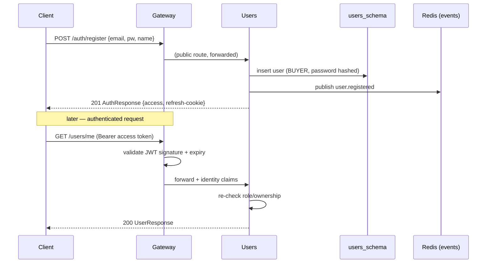

# Feature — Authentication & RBAC

**Services:** Users (:8081), Gateway (:8080) · **Tier:** Implemented

Identity and access control for the whole platform: who you are (authentication)
and what you may do (authorization by role).

## Behaviour

- A visitor **registers** with email + password and receives `BUYER` by default.
- A user **logs in** and receives a short-lived **access token** (JWT) and a
  long-lived **refresh token**.
- The access token authorizes API calls for 15 minutes; when it expires, the client
  **refreshes** to get a new one without re-entering credentials.
- **Logout** revokes the refresh token.
- Two roles: **`BUYER`** (shop, order, view own data) and **`ADMIN`** (manage
  catalogue, view all orders, change roles). An admin can **promote/demote** users.

## Token design

| | Access token | Refresh token |
|---|---|---|
| Format | JWT, **HS256** (`jjwt` 0.12.3) | Opaque **UUID** |
| Lifetime | 15 minutes | 7 days |
| Claims / data | `sub` (userId), `email`, `role`, `iat`, `exp` | — |
| Storage | Stateless (not stored) | **SHA-256 hashed** in `refresh_tokens`; delivered as an **httpOnly cookie** |
| Revocation | Not revocable (short life is the mitigation) | Revocable — `revoked` flag; rotated on use |

Why this split: a short, stateless access token keeps the hot path
verification-only (no DB lookup per request — the Gateway just checks the
signature), while the refresh token, being stateful and hashed-at-rest, gives us
revocation and a 7-day session without a long-lived bearer credential floating
around. Storing only the **hash** means a database leak does not yield usable
tokens.

## Authorization model

Enforcement is **two-layered**:

1. **At the Gateway** — public routes are explicitly allow-listed; everything else
   requires a valid access token, verified once at the edge
   ([ADR-006](../adr/ADR-006-api-gateway.md)). The verified claims (incl. `role`)
   are forwarded downstream.
2. **In the service** — role checks are re-applied on `[ADMIN]`/`[BUYER]` endpoints.
   The Gateway is not trusted as the sole gate (defence in depth), and ownership
   checks ("a buyer sees only their own orders") can only be done by the owning
   service.

**Public surface (no JWT):** `POST /auth/**`, `GET /products`, `GET /products/{id}`,
`GET /categories`. Everything else requires authentication; admin operations
require `role=ADMIN`.

## Primary flows

### Registration → login → authenticated call

### Refresh & rotation

On `POST /auth/refresh` (refresh cookie presented): look up the token by hash,
verify it is unexpired and not revoked, **rotate** it (revoke the old, issue a new),
and return a fresh access token. Rotation means a stolen refresh token is usable at
most until the legitimate client next refreshes (which invalidates it).

## Edge cases & failure handling

| Case | Behaviour |
|---|---|
| Duplicate email at registration | 409 Conflict; no user created (DB unique constraint on `email`). |
| Wrong password / unknown email at login | 401, **identical** response/timing for both — no account enumeration. |
| Expired access token | 401; client should refresh. |
| Expired / revoked / unknown refresh token | 401; client must re-login. |
| Refresh-token reuse after rotation | Treated as compromise signal — the presented token is already revoked, so it fails; (production: revoke the whole token family). |
| Inactive user (`active=false`) | Authentication denied even with valid credentials. |
| Rate-limited auth endpoint | 429 (10 req/min/IP, [ADR-006](../adr/ADR-006-api-gateway.md)) — brute-force mitigation. |

## Security notes

- Passwords hashed with a strong adaptive hash (bcrypt/Argon2-class) — never stored
  or logged in plaintext.
- **No PII in logs** — log `userId`, never email/password (per the security
  guardrails). Auth failures log the *reason*, not the credential.
- The JWT signing secret is configuration/secret-managed, never committed
  (production: Vault).

## Events published

| Event | When | Consumed by |
|---|---|---|
| `user.registered` | New user created | Notifications (welcome email) |
| `user.role_changed` | Admin changes a role | Notifications |

## Test coverage

- **Unit**: token claim construction, password hashing, role-transition rules.
- **Integration (Testcontainers)**: full register→login→refresh→logout against real
  PG + Redis; rejection of expired/revoked tokens; duplicate-email conflict.

## Related

- [ADR-006](../adr/ADR-006-api-gateway.md) (edge auth) ·
  [C4 L3 — Users](../c4/L3-components.md#users-8081)
