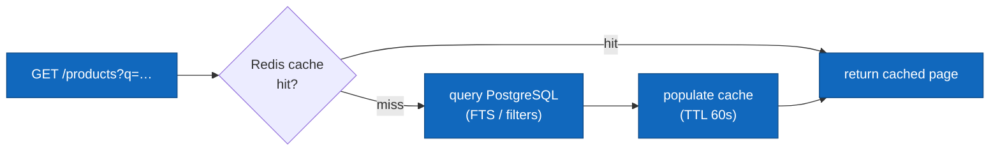

# Feature — Catalogue & Search

**Service:** Products (:8082) · **Tier:** Implemented

The shopper-facing read path: browsing products, filtering, searching, and
categories. This is the platform's **hottest read path**, which is why it is the
one place CQRS and caching are applied ([ADR-011](../adr/ADR-011-cqrs.md)).

## Behaviour

- Anyone (no auth) can **list** products with pagination and **filter** by category,
  price range, and stock availability.
- Anyone can **search** by free text across name and description.
- Anyone can **view** a single product and **list categories**.
- Results are **sorted** per a `sort` parameter (e.g. price, name, recency).
- Admin product *writes* (create/update/delete) are covered under
  [CSV Import](csv-import.md) and the admin CRUD endpoints; this spec is the **read**
  side.

## API

`GET /api/v1/products` (public, paginated) with query parameters:

| Param | Meaning |
|---|---|
| `q` | Full-text query over name + description |
| `category` | Filter by category |
| `minPrice` / `maxPrice` | Price range |
| `inStock` | Only products with `stock > 0` |
| `page` / `size` | Pagination |
| `sort` | Sort field + direction |

Plus `GET /products/{id}` and `GET /categories` (both public).

## Full-text search

Search uses PostgreSQL native FTS — a **GIN index** over
`to_tsvector('english', name || ' ' || coalesce(description,''))`
([ADR-001](../adr/ADR-001-database.md)). No separate search engine. This handles
stemming and ranking for a catalogue of this size; a dedicated engine
(Elasticsearch/OpenSearch) is the documented scale-up if relevance tuning or
catalogue size demands it.

## Read path & caching (CQRS)

- List/search results are cached in Redis with a **60s TTL**
  ([ADR-011](../adr/ADR-011-cqrs.md)).
- Writes (admin CRUD, CSV import) **evict** affected entries; the TTL is the
  backstop for any missed eviction, bounding staleness at 60 seconds.
- **Stock levels are never cached.** A product card may show cached presentation
  data, but stock for reservation is always read live ([Order Placement](order-placement.md)) —
  caching it would let the system reserve against a stale count.

## Edge cases & failure handling

| Case | Behaviour |
|---|---|
| No results | 200 with an empty page (not 404) — "nothing matched" is a valid result. |
| Invalid filter (e.g. `minPrice > maxPrice`, negative price) | 400 with a clear validation message. |
| `page` beyond the last | 200 with an empty page; total-count metadata still returned. |
| Inactive product (`active=false`) | Excluded from public listings; direct `GET /{id}` returns 404 to the public (admins can see it). |
| Special characters / injection in `q` | Parameterised query + FTS tokenisation; input is never concatenated into SQL. |
| Cache unavailable (Redis down) | **Degrade gracefully** — fall through to PostgreSQL. Reads stay correct, just slower; the cache is an optimisation, not a dependency for correctness. |

## Events consumed / published

Products publishes `product.created/updated/deleted/stock_low/stock_depleted/imported`
(see [CSV Import](csv-import.md) and [Purchase Saga](purchase-saga.md)). The read
path itself publishes nothing — it is a pure query.

## Test coverage

- **Unit**: filter/sort parameter validation, query-spec construction.
- **Integration (Testcontainers)**: real FTS ranking against PG; cache hit/miss and
  eviction-on-write; graceful fallthrough when Redis is unavailable.
- **Performance (k6)**: product search under load — the primary read scenario.

## Related

- [ADR-011](../adr/ADR-011-cqrs.md) (read model) · [ADR-001](../adr/ADR-001-database.md)
  (FTS) · [CSV Import](csv-import.md) (the write side)
