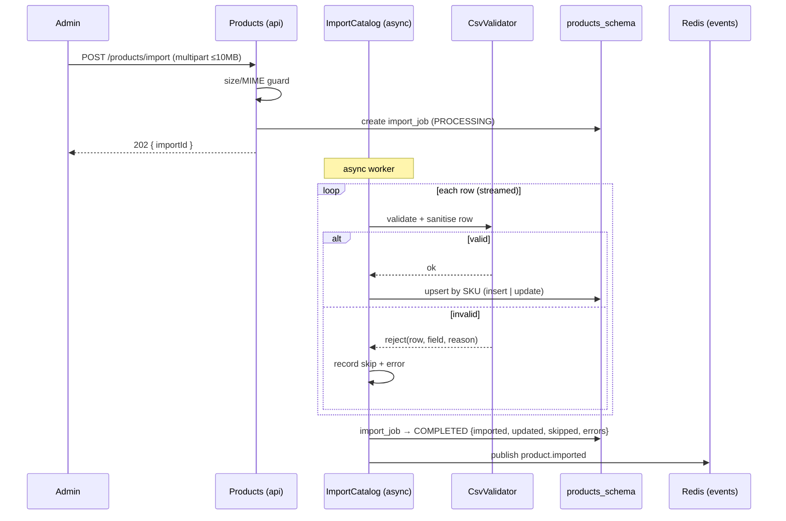

# Feature — CSV Import

**Service:** Products (:8082) · **Tier:** Implemented

Bulk catalogue import from an admin-uploaded CSV. This is the feature where input is
**least trustworthy** — real-world product exports are messy — so the design centres
on robust, row-level handling of bad data rather than the happy path.

## Behaviour

- An admin uploads a CSV (max **10MB**). The endpoint validates and accepts it,
  returns **`202 Accepted` with an `importId` immediately**, and processes
  **asynchronously** — the admin is not blocked on a large file.
- The admin **polls** `GET /products/import/{id}` for status and a result summary.
- Each row is validated **independently**. **One bad row never fails the batch** —
  good rows import, bad rows are skipped and reported.
- Import is an **upsert by SKU**: a row whose SKU already exists **updates** the
  product; a new SKU **inserts** one.
- The result reports `{ imported, updated, skipped, errors[] }`, where each error
  names the row, field, value, and reason.

## API

```
POST /api/v1/products/import        [ADMIN] multipart  → 202 { importId }
GET  /api/v1/products/import/{id}    [ADMIN]            → job status + summary
```

## Flow



The file is **streamed**, not loaded whole into memory, so a 10MB file does not
translate into a large heap spike.

## Edge cases — the heart of this feature

The sample data deliberately includes messy rows. Each must be handled without
aborting the batch:

| Input condition | Handling |
|---|---|
| **XSS in name** (`<script>…`) | Sanitised — tags stripped/escaped before persistence. Never stored raw, never reflected. |
| **SQL injection in a field** | Parameterised writes; input is data, never concatenated SQL. |
| **Price as string** (`"$29.99"`) | Parsed — currency symbols/whitespace stripped, coerced to `NUMERIC(10,2)`. |
| **Price `"free"`** (non-numeric) | Row skipped with a clear reason — *unless* it resolves to a valid `0` per rules below. |
| **Zero price** (Mystery Box) | **Valid** — `price = 0` passes `CHECK (price >= 0)`. |
| **Negative stock** | Rejected — violates `CHECK (stock >= 0)`; row skipped, reason recorded. |
| **Stock `99999`** (Gift Card) | **Valid** — large stock is allowed (effectively unlimited). |
| **Duplicate SKU** within/across the file | **Upsert, not reject** — last write for that SKU wins; counted as `updated`. |
| **Empty rows** (trailing blanks) | Silently ignored — not counted as errors. |
| **Missing required field** (`name` or `sku`) | Row skipped; reason recorded. |
| **Whitespace-only name** | Treated as missing — skipped. |
| **Blank category** | Allowed — product imported with no category (`category_id` null). |
| **Unicode / encoding issues** | Parsed as UTF-8; malformed bytes handled per-row, not fatal. |

The `errors[]` entries follow the `ImportError(row, field, value, reason)` shape so
the admin gets actionable feedback per failure.

## Why async

A synchronous import would tie up an HTTP connection for the duration of a large
file and risk timeouts. Returning `202 + importId` and processing in the background
([ADR-011](../adr/ADR-011-cqrs.md) write side) keeps the API responsive and gives a
natural place to report progress and a durable result (`import_jobs` row).

## Events published

| Event | Payload highlights | Consumed by |
|---|---|---|
| `product.created` / `product.updated` | per affected product | Notifications, Orders |
| `product.imported` | `{ totalRows, imported, updated, skipped, errors[], durationMs }` | Notifications |

## Test coverage

- **Unit**: `CsvValidator` against every edge case above — this is the most
  unit-test-dense component in the system, by design.
- **Integration (Testcontainers)**: full async import against real PG (upsert
  semantics, partial-success summary).
- **E2E (Playwright)**: admin uploads a file with deliberate errors and sees the
  per-row error report.

## Related

- [ADR-001](../adr/ADR-001-database.md) (CHECK constraints) ·
  [Catalogue & Search](catalogue-and-search.md) (cache eviction on write) ·
  security guardrail: validate & sanitise at the boundary.
