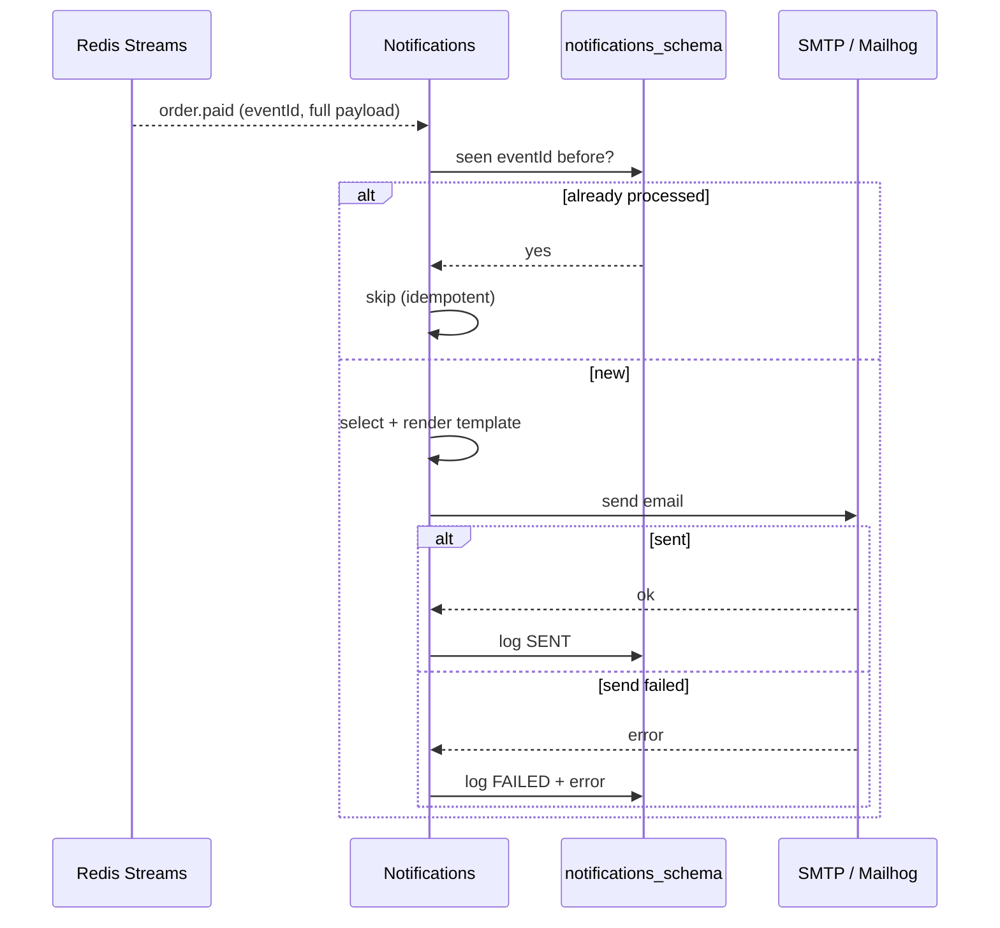

# Feature — Notifications

**Service:** Notifications (:8085) · **Tier:** Implemented

Transactional email driven entirely by events. Notifications is the cleanest
example of an **event-driven, decoupled consumer** in the system: it reacts to what
other services *did*, and no service ever calls it.

## Behaviour

- Notifications **consumes** domain events and, for those that warrant a message,
  renders an email template and sends it via SMTP (Mailhog locally).
- Every send (success or failure) is recorded in a **delivery log**.
- It has **no public API** except one admin read endpoint:
  `GET /api/v1/notifications/logs` (`[ADMIN]`).
- It **publishes no events** and **calls no other service** — a pure sink.

This is the architectural point of the service: it proves the event backbone
([ADR-002](../adr/ADR-002-event-bus.md)) allows a whole capability to be added (or
removed) with **zero changes to producers**. Orders does not know Notifications
exists.

## Triggering events & templates

Seven event types trigger email:

| Event | Email |
|---|---|
| `user.registered` | Welcome |
| `user.role_changed` | Role/access change notice |
| `product.stock_low` | Low-stock alert (to admins) |
| `product.stock_depleted` | Out-of-stock alert (to admins) |
| `product.imported` | Import summary (to the requesting admin) |
| `order.paid` | Order receipt (to buyer) |
| `order.failed` | Payment-failure notice (to buyer) |

Templates render from the event payload. Because events carry **full state**, the
template has everything it needs — Notifications never calls back to Orders or Users
to enrich a message ([ADR-003](../adr/ADR-003-choreography.md)).

## Flow

## Idempotency

Consumers are **idempotent on `eventId`**: a redelivered event does not send a
duplicate email. The delivery log doubles as the dedup record — if an `eventId` is
already logged as `SENT`, the redelivery is skipped. This matters because Redis
Streams guarantees at-least-once delivery, so duplicates are expected, not
exceptional.

## Edge cases & failure handling

| Case | Behaviour |
|---|---|
| Redelivered event | Skipped via `eventId` dedup — no duplicate email. |
| SMTP send fails | Logged as `FAILED` with the error; the message is **not** silently dropped — it is visible in the log for follow-up (and retryable). |
| Event for which no template applies | Acknowledged and ignored — not every consumed event emails. |
| Recipient address missing/invalid in payload | Logged as `FAILED` with reason; does not crash the consumer. |
| Notifications down when events fire | Redis retains them; consumed on recovery — emails are delayed, not lost. |
| PII in logs | The log stores `recipient` (operationally necessary) but application logs never emit email bodies or other PII (security guardrail). |

## Data

`notification_log(event_id, event_type, recipient, template, status, error,
created_at)` — the audit trail of every notification attempt, queryable by admins.

## Test coverage

- **Unit**: template selection per event type; idempotency/dedup logic.
- **Integration (Testcontainers)**: consume real events from Redis Streams → assert
  a log row; redelivery produces no duplicate; SMTP-failure path logs `FAILED`
  (Mailhog as the test SMTP sink).

## Related

- [ADR-002](../adr/ADR-002-event-bus.md) (the bus it consumes) ·
  [Purchase Saga](purchase-saga.md) (most triggers originate here) ·
  [C4 L3 — Notifications](../c4/L3-components.md#notifications-8085)
