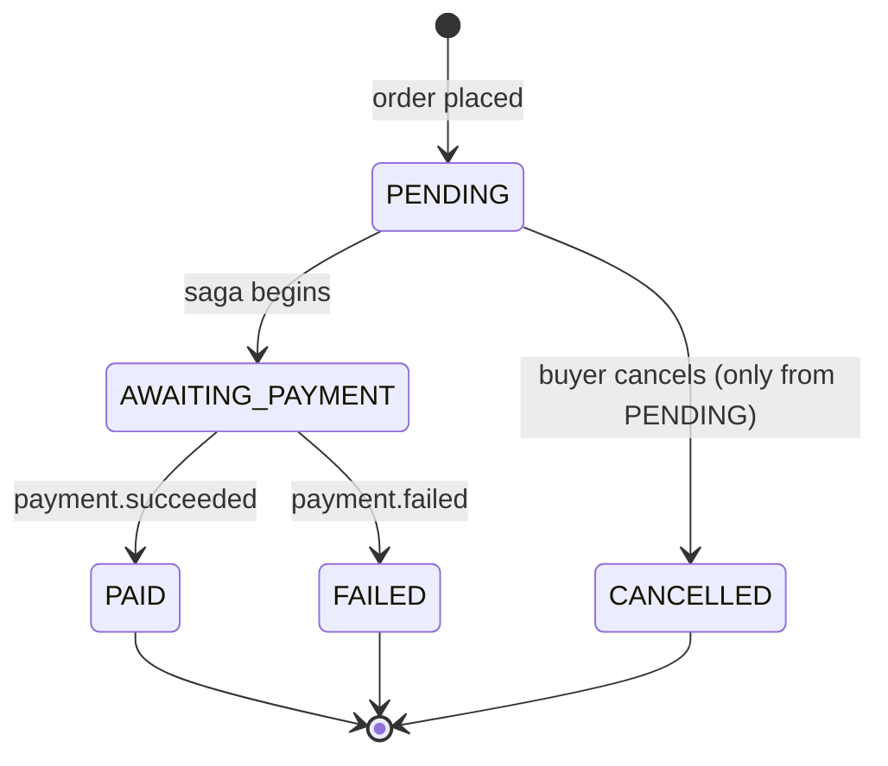

# Feature — Order Placement & Stock Reservation

**Services:** Orders (:8083), Products (:8082) · **Tier:** Implemented

Turning a cart into a confirmed order. This is the most concurrency-sensitive flow
in the system: two buyers racing for the last unit of stock must not both succeed,
and a client that retries a submission must not create two orders.

## Behaviour

- A `BUYER` submits an order (a list of `{productId, quantity}`) with an
  **`Idempotency-Key`** header.
- Orders confirms and **reserves** stock for every line with Products
  (synchronous, gRPC) before creating the order.
- If all stock is available, the order is created in **`PENDING`** and
  `order.placed` is published — handing off to the [Purchase Saga](purchase-saga.md).
- If any line lacks stock, the order is rejected atomically — nothing is reserved.
- A buyer can `GET` their own orders and **cancel** an order while it is `PENDING`.

## Order status state machine



The legal transitions live in the **domain** as pure rules
([ADR-004](../adr/ADR-004-hexagonal-arch.md)) — an illegal transition (e.g.
cancelling a `PAID` order) is rejected by the domain, not just the controller.

## Idempotent placement

`POST /orders` requires an **`Idempotency-Key`**. The key is stored in Redis
(TTL 24h) and, uniquely, on the `orders` row (`idempotency_key UNIQUE`):

- **First** request with a key → process normally, store the result.
- **Repeat** with the same key (client retry, double-click, network retry) →
  return the **original** order, do not create a second.

This makes order submission **safe to retry** — essential because the client cannot
always tell whether a timed-out request actually succeeded.

## Stock reservation under concurrency

The crux. Reservation must be **atomic** so concurrent orders cannot oversell:

```mermaid
sequenceDiagram
    participant O as Orders
    participant P as Products (gRPC server)
    participant DB as products_schema

    O->>P: gRPC reserveStock([{sku, qty}…])
    P->>DB: BEGIN
    loop each line
        P->>DB: UPDATE stock = stock - qty WHERE sku = ? AND stock >= qty
        Note over P,DB: rows affected = 1 → reserved; 0 → shortfall
    end
    alt every line affected 1 row
        P->>DB: COMMIT
        P-->>O: reserved ✓
    else any line affected 0 rows
        P->>DB: ROLLBACK
        P-->>O: insufficient stock ✗ (which sku)
    end
```

- Reservation is a single **conditional, row-locked `UPDATE … SET stock = stock -
  :qty WHERE sku = :sku AND stock >= :qty`** per line, all within one transaction.
  The `WHERE stock >= :qty` makes it atomic: two buyers racing the last unit
  serialise on the row, exactly one `UPDATE` affects a row, the other affects zero
  → reported as a shortfall. No separate `SELECT … FOR UPDATE` step is needed; the
  conditional `UPDATE` *is* the lock-and-check ([ADR-015](../adr/ADR-015-concurrency-and-locking.md)).
- **All-or-nothing across lines:** if any line affects zero rows, the transaction
  rolls back, undoing decrements already applied to earlier lines.
- This is why integration tests run against **real PostgreSQL**, not H2
  ([ADR-008](../adr/ADR-008-testcontainers.md)): the locking behaviour *is* the feature.
- The `CHECK (stock >= 0)` constraint is the final backstop — even a logic bug
  cannot persist negative stock.
- Stock is read **live**, never from cache ([ADR-011](../adr/ADR-011-cqrs.md)).

> **Note on "reservation" vs decrement.** In this implementation, reservation is a
> direct decrement within the locked transaction; the compensating action on
> failure ([Purchase Saga](purchase-saga.md)) *releases* (re-increments) it. A
> production system might hold a separate timed reservation; that refinement is
> noted but not built.

## Edge cases & failure handling

| Case | Behaviour |
|---|---|
| Insufficient stock on any line | 409/422; **no** partial reservation — the whole order fails atomically. Response names the short SKU. |
| Repeated `Idempotency-Key` | Returns the original order (200), no duplicate. |
| Missing `Idempotency-Key` | 400 — the header is required for a non-idempotent create. |
| Two buyers, last unit | `FOR UPDATE` serialises them: one succeeds, the other gets insufficient-stock. Verified by a concurrent integration test. |
| Products (gRPC) unavailable | Placement fails fast (timeout/circuit breaker) — correctly *prevents* an unbacked order rather than creating one. |
| Cancel a non-`PENDING` order | Rejected by the domain state machine. |
| Product price/details changed after add-to-cart | The order snapshots `sku, name, unit_price` at placement (`order_items`) — the order is immune to later catalogue edits. |

## Events

| Event | When | Consumed by |
|---|---|---|
| `order.placed` (published) | Order created in `PENDING` | Payments, Notifications — **starts the saga** |
| `order.cancelled` (published) | Buyer cancels a `PENDING` order | Products (release stock), Notifications |
| `product.updated` / `deleted` / `stock_depleted` (consumed) | Catalogue changes | Orders reacts (e.g. guards against deleted products) |

## Test coverage

- **Unit**: the order state machine (every legal/illegal transition), total
  calculation, idempotency-key logic.
- **Integration (Testcontainers)**: idempotent placement (same key → one order);
  **concurrent reservation for the last unit** against real PG locking; atomic
  multi-line rejection.
- **Contract**: the one illustrative Spring Cloud Contract is the Orders `POST`.

## Related

- [Purchase Saga](purchase-saga.md) (what `order.placed` triggers) ·
  [ADR-009](../adr/ADR-009-grpc-internal.md) (the gRPC call) ·
  [ADR-008](../adr/ADR-008-testcontainers.md) (why real PG)
