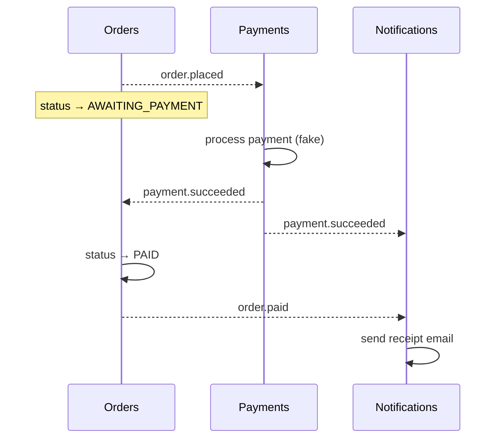
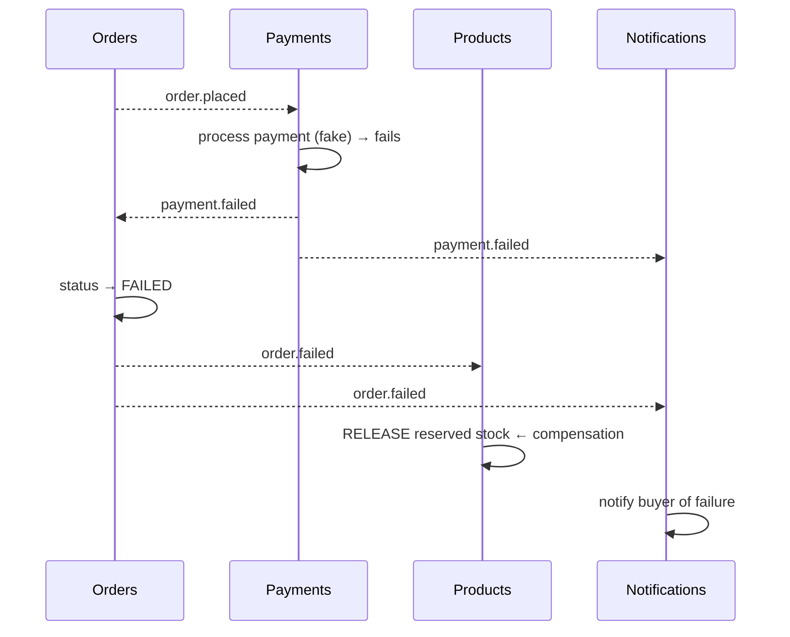

# Feature — Purchase Saga

**Services:** Orders, Payments, Products, Notifications · **Tier:** Implemented

The system's defining behaviour: driving a placed order to `PAID` or `FAILED`
across four services with **no distributed transaction**, using choreographed events
and compensation ([ADR-003](../adr/ADR-003-choreography.md)). Read
[Order Placement](order-placement.md) first — this spec picks up the moment
`order.placed` is published.

## The two paths

### Happy path

### Compensation path (payment fails)

The key idea: the stock decrement done during placement is **undone** by Products
consuming `order.failed` (or `order.cancelled`). That release is the saga's
**compensating transaction** — the substitute for a rollback that cannot exist
across service boundaries.

## The fake payment processor

Payments has **no external PSP** — it is an in-process processor that succeeds ~90%
of the time and fails ~10% ([C4 L1](../c4/L1-system-context.md)). This is
deliberate: it lets the **compensation path run on demand**, so the hard part of the
saga (recovery, not the happy path) is exercised in every test run and demo. In
tests the outcome is made **deterministic** (seeded) so the compensation path can be
asserted reliably. Swapping in a real PSP is an adapter change behind the same
events.

## Idempotency & ordering — why this is safe

Choreography means events can be **redelivered** and can arrive **out of order**.
The saga stays correct because:

- Every consumer is **idempotent on `eventId`** — applying `payment.succeeded`
  twice sets the order `PAID` once; releasing stock twice on a duplicate
  `order.failed` is a no-op.
- Each event carries **full state** (e.g. `OrderFailedEvent` includes the line
  items), so a consumer like Products can release exactly what was reserved without
  querying back — no synchronous coupling inside the reaction.
- The order **state machine** ([Order Placement](order-placement.md)) rejects
  illegal transitions, so a stale/duplicate event cannot move an order backwards.

## Dead-letter handling

A **DLQ example is implemented on `payment.failed`** (illustrative tier): a message
that repeatedly fails processing is routed to a dead-letter stream after a bounded
number of redeliveries, rather than blocking the consumer or being lost. This
demonstrates the poison-message pattern without building DLQs for all 15 streams.

## Event catalogue

All 15 events, publisher → subscribers. Every event extends a shared `BaseEvent`
envelope (`eventId`, `eventType`, `version`, `timestamp`, `traceId`, `producedBy`)
— the `eventId` is the idempotency key.

| Stream | Publisher | Subscribers |
|---|---|---|
| `user.registered` | Users | Notifications |
| `user.role_changed` | Users | Notifications |
| `product.created` | Products | Notifications |
| `product.updated` | Products | Orders |
| `product.deleted` | Products | Orders |
| `product.stock_depleted` | Products | Notifications, Orders |
| `product.stock_low` | Products | Notifications |
| `product.imported` | Products | Notifications |
| `order.placed` | Orders | Payments, Notifications |
| `order.paid` | Orders | Notifications |
| `order.failed` | Orders | Products, Notifications |
| `order.cancelled` | Orders | Products, Notifications |
| `payment.succeeded` | Payments | Orders, Notifications |
| `payment.failed` | Payments | Orders, Notifications |
| `payment.refunded` | Payments | Orders, Notifications |

The graph is **acyclic** by design — a deliberate guard against the choreography
failure mode where events trigger each other in a loop
([ADR-003](../adr/ADR-003-choreography.md)).

## Edge cases & failure handling

| Case | Behaviour |
|---|---|
| `payment.succeeded` redelivered | Order set `PAID` once (idempotent); no duplicate receipt. |
| `payment.failed` then a late duplicate `succeeded` | State machine + idempotency prevent regressing a `FAILED`/already-resolved order. |
| Stock-release event redelivered | Re-increment is guarded by `eventId` dedup — released once. |
| A consumer is down when an event is published | Redis Streams retains it; the consumer group reads it on recovery — no loss. |
| Poison `payment.failed` message | Routed to DLQ after bounded retries (illustrative). |
| Buyer cancels a `PENDING` order | `order.cancelled` → same compensation as failure (stock released, buyer notified). |

## Test coverage

- **Unit**: payment-outcome handling; consumer idempotency logic.
- **Integration (Testcontainers)**: full purchase flow end-to-end on real Redis
  Streams — **both** happy and compensation paths (forced failure); redelivery
  safety.
- **E2E (Playwright)**: a complete purchase through the UI.

## Related

- [ADR-003](../adr/ADR-003-choreography.md) (choreography) ·
  [ADR-002](../adr/ADR-002-event-bus.md) (the bus) ·
  [Order Placement](order-placement.md) · [Notifications](notifications.md)
